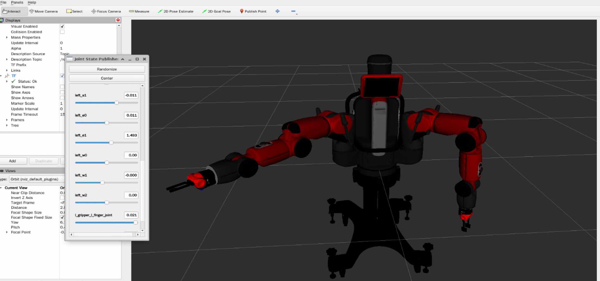

# Baxter ROS2 Simulation

ROS2 package for simulating the Rethink Robotics Baxter robot in RViz.

## Screenshot



## Description
This package contains the URDF description and necessary configuration files for visualizing and simulating the Baxter dual-arm robot in RViz. The package includes:
- URDF/Xacro model of the Baxter robot
- Mesh files for visualization
- Launch files for displaying in RViz
- Configuration files for robot control
- Support for the electric gripper

## Dependencies
- Ubuntu 22.04
- ROS2 (tested on ROS 2 Humble)
- joint_state_publisher_gui
- robot_state_publisher
- rviz2
- xacro

## Installation

1. Create a workspace (if you don't have one):
   ```bash
   mkdir -p ~/ros2_ws/src
   cd ~/ros2_ws/src
   ```

2. Go to src and Clone this repository there:
   ```bash
   cd ~/ros2_ws/src
   git clone https://github.com/dabaspark/robot_ros2_simulation.git
   ```

3. Install dependencies:
   ```bash
   sudo apt update
   sudo apt install ros-humble-joint-state-publisher-gui
   sudo apt install ros-humble-robot-state-publisher
   sudo apt install ros-humble-xacro
   sudo apt install python3-catkin-pkg
   ```

4. Source ROS2 and Build the package:
   ```bash
   source /opt/ros/humble/setup.bash
   cd ~/ros2_ws
  colcon build --symlink-install
   ```

## Usage

1. Source your workspace:
   ```bash
   source ~/ros2_ws/install/setup.bash
   ```

2. Launch the robot visualization in RViz:
   ```bash
   ros2 launch baxter_ros2_simulation display.launch.py
   ```

   Optional arguments:
   - `gripper_enabled:=true` (default: true) - Enable/disable the electric grippers
   - `pedestal:=true` (default: true) - Show/hide the pedestal

## Features
- Full URDF/Xacro model of the Baxter robot
- Support for both standard end effectors and electric grippers
- Configurable pedestal mount
- Joint state visualization and control through joint_state_publisher_gui
- RViz configuration for easy visualization

## Acknowledgments
- Original Baxter robot and URDF files by Rethink Robotics
